# GYM Shadule App with Flutter Firebase Authentication

A simple Flutter application that demonstrates Firebase authentication and a Gym Shadule list using Cloud Firestore.

<table>
  <tr>
    <td>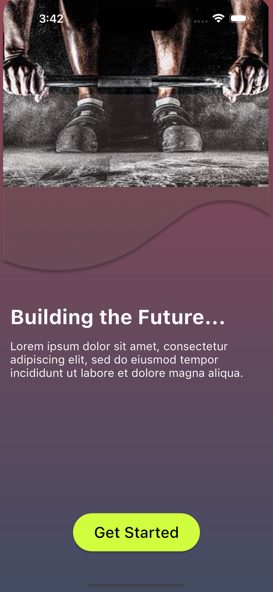</td>
    <td>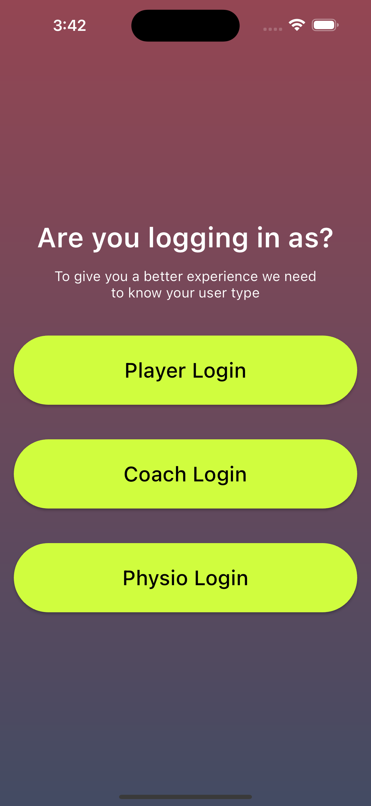</td>
    <td>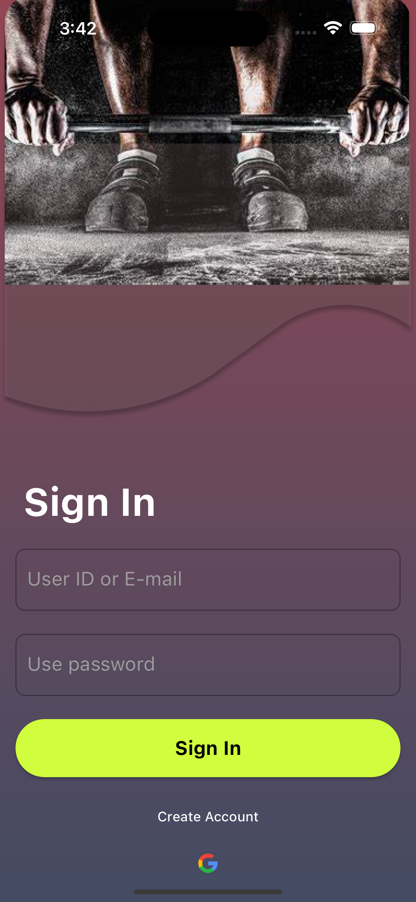</td>
    <td>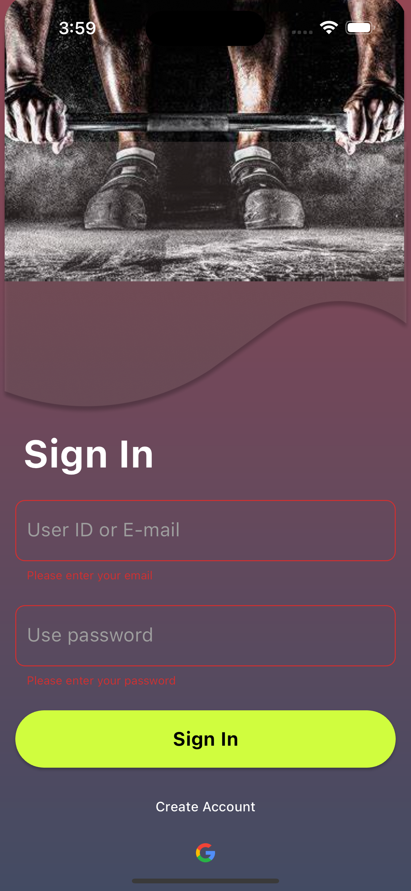</td>
    <td>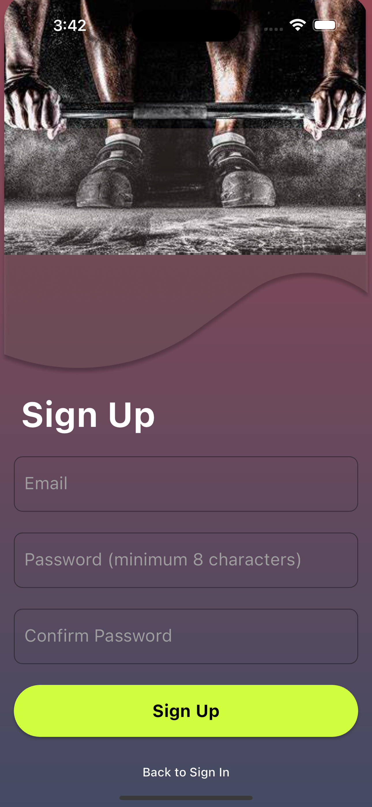</td>
    <td>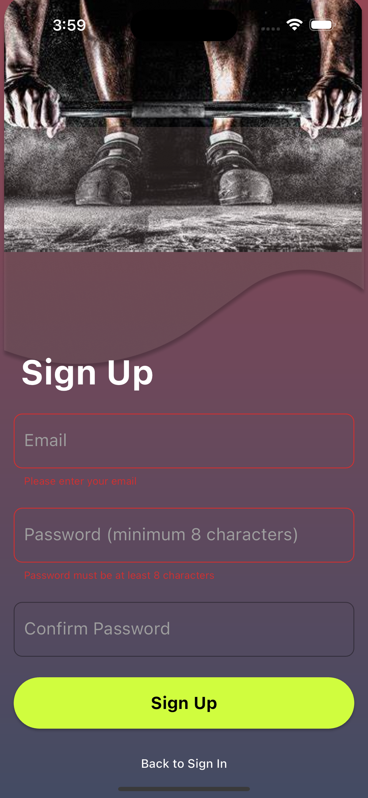</td>
    <td>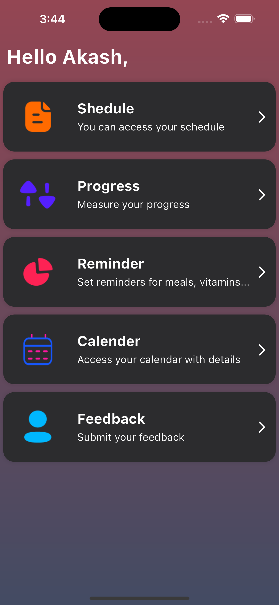</td>
    
  </tr>
  <tr>
    <td>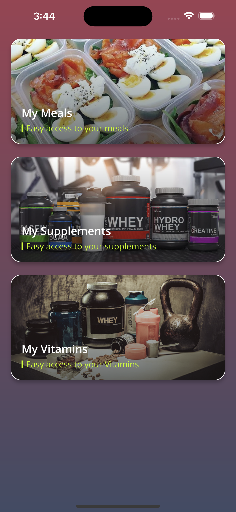</td>
    <td></td>
    <td>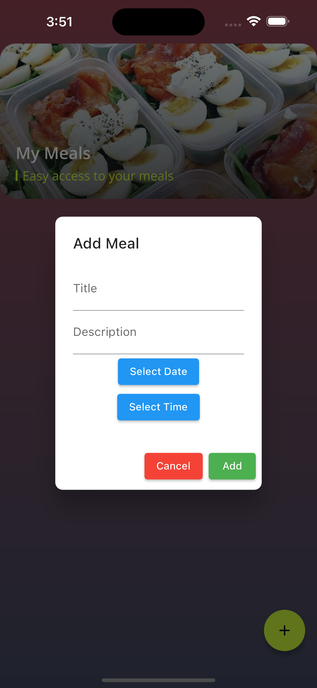</td>
    <td>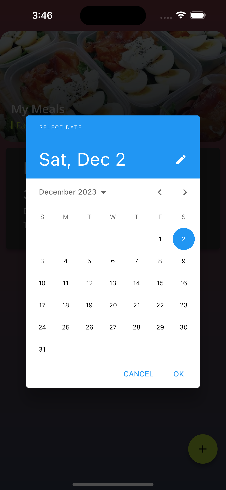</td>
    <td>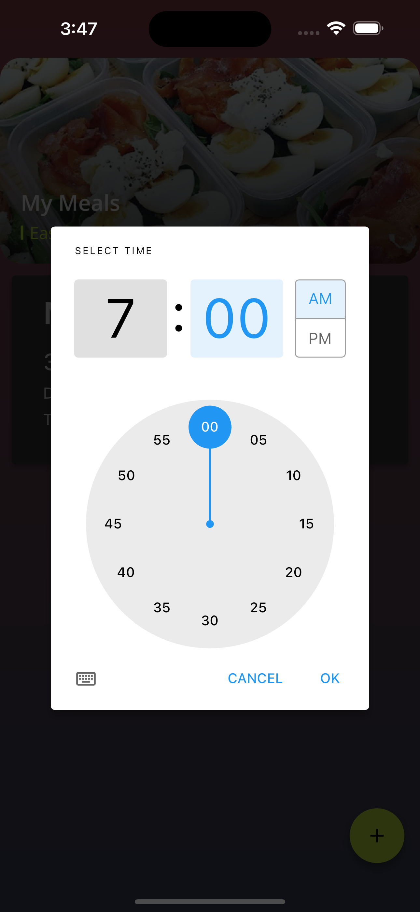</td>
    <td>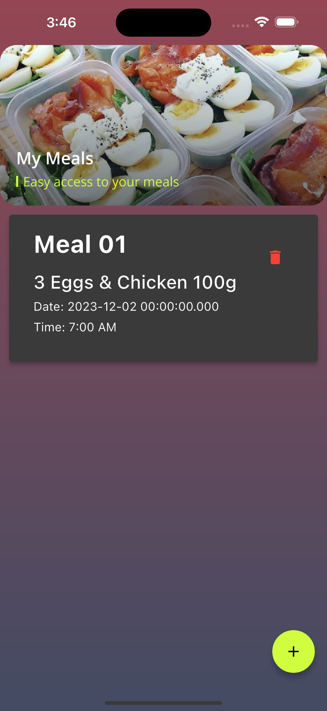</td>
    <td>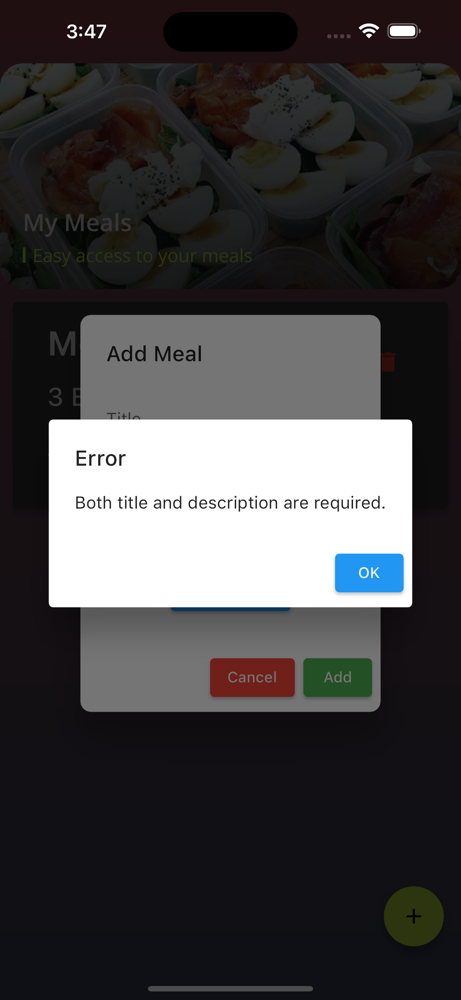</td>
  </tr>

</table>

## Getting Started

Before you begin, make sure you have Flutter and Firebase set up in your development environment.

- [Flutter Installation Guide](https://flutter.dev/docs/get-started/install)
- [Firebase Console](https://console.firebase.google.com/)

